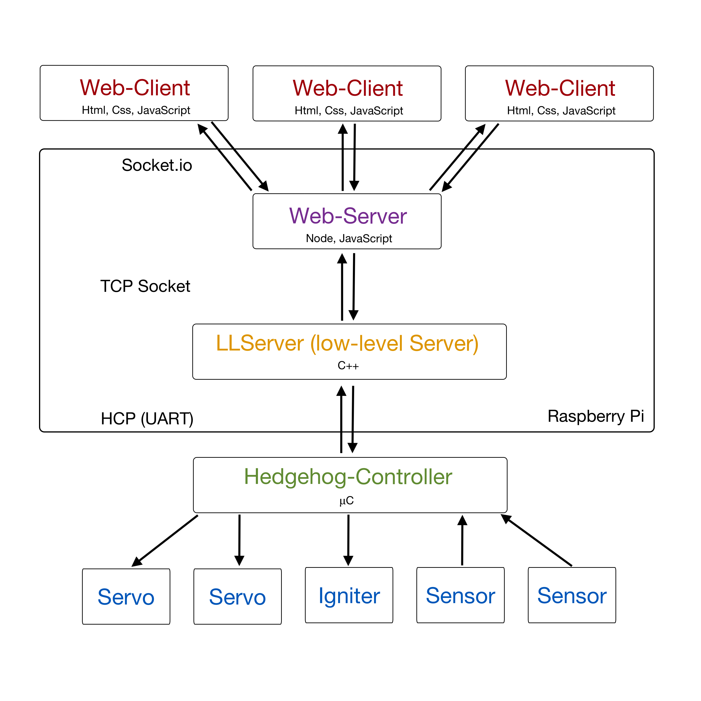

# ECUI (Engine Control Unit Interface)

This project was originally developed to construct a user interface for the development of a Rocket Engine at a testing facility. It represents a foundation for a future Project which enables full control for a rocket launch procedure, like "Mission Control". There are three main design goals which had been followed during development:

1. A possibility to provide the current state of the facility to an arbitrary number of users/viewers.
2. A very accurate timing interface, to execute commands at a precise point in time.
3. A monitoring surface for all sensor values on the test stand.

To enable all of these features, multiple Software Layers have been developed. 

## Table of Contents

1. [Run](#run)
2. [Install](#install)
3. [Architecture](#architecture)
4. [Web-Client](#web-client)
5. [Web-Server](#web-server)
6. [LLServer](#llserver-low-level-server)
7. [ECUI-Protocols](#ecui-protocols)
8. [JSON-Formats](#json-formats)
9. [Appendix](#appendix)

## Run

To run ECUI first turn on the Controller and connect via an Ethernet Cable from your PC to the Controller
Then open your Terminal (CMD) and open an ssh connection to the raspberry pi

	ssh pi@raspberrypi.local
	
Password is raspberry
Then change to the LLServer directory

	cd TXV_ECUI_LLServer/
	./TXV_ECUI_LLSERVER
	
If something goes wrong you can restart it with

	./TXV_ECUI_LLSERVER
	
After that you can go into Google Chrome and type in the search bar

	raspberrypi.local:3000
	
To edit a Sequence or Checklist open FileZilla on your PC and connect to the ECUI
Then open the TXV_ECUI_WEB -> sequence folder and Rightclick on 
Sequence.json or Checklist.json and and choose edit

then you can edit the sequence or checklist

when you're done press STRG+S and go back to FileZilla. Choose "Delete Local File and upload" and click Yes
then you can refresh the Webpage in the Browser.

To view the logs go in FileZilla into the TXV_ECUI_LLServer -> logs folder and download the desired log file
	
	

## Install

To install the ecui, pull both the TXV_ECUI_WEB and the TXV_ECUI_LLServer Repositories. 
For the WebServer **node** and **Socket.io** are required. 
For the LLServer you only need gcc and cmake
If the Warning Light Neopixel is also desired, ask an avionics guy for help

Commands to run the ecui

In the TXV_ECUI_WEB folder execute

	bash install.sh
	
and in TXV_ECUI_LLServer, if no console ouputs are required

	bash install.sh
	
else exec

	cmake . -DCMAKE_BUILD_TYPE:STRING=Release
	make -j 3
	./TXV_ECUI_LLSERVER

if Warning Light is installed execute

	sudo python3 ../warnlight/testapp_sock.py &
	
beforehand

## Architecture

The user interface is written in HTML, CSS and JavaScript. This approach helps to generate a dynamic GUI and 
and provides Tablet and Smartphone support built in. In addition a **Web-Server** is running in the background, so the user interface can be opened with multiple devices at the same time. Currently the last user who connected to the server functions as the **master**. This means that only that user is able to control the test stand, while all others are only **watchers** and cannot manipulate or interfere any ongoing process.
The communication Protocol used between Web-Client and Web-Server is called Socket.io. 

The **LLServer** functions mainly as an accurate Timer and sends commands defined by the Sequence-File
to the **Hedgehog-Controller**

## Web-Client

The Web-Client provides the interface between the end user and the ECUI System. When the Raspberry-Pi
is connected to the same network, it can be accessed in Chrome, Firefox or Safari via the URL: 

[raspberrypi.local:3000](http://raspberrypi.local:3000)

If multiple Clients are connected to the Server it automatically syncs any changes on one client to the others.
There are 3 tabs located at the top of the Webpage: the Monitor-Tab, the Control-Tab and the Calibration-Tab. 

### Monitor Tab

When the Webpage has been loaded, it first displays the **Checklist** on the right side of the display, and the 
**Sequence Chart** on the left side. When all Items in the Checklist have been ticked, an Start Sequence button 
appears. Clicking it starts the Countdown and displays live data on the bottom of the screen.

### Control Tab

In this view the "Enable Manual Control" Checkbox can be clicked to enable manual servo and motor (used for Igniter) control.
Each Servo can be moved with the sliders between 0% and 100%. The Igniter can be enabled via a Checkbox.
The Saftl button sets the Fuel servo to 100% for 2 seconds.

### Calibration Tab

Here manual control has to be enabled first. Then the raw value of a servo can be set by writing a number in the
text box. By clicking the Set Min/Set Max button, the minimum/maximum position of the servo can be set. This is used to map the percentage value in the sequence file to the actual servo position.

> **CAREFUL:** SERVOS CAN BE DESTROYED WHEN VALUE IS TOO HIGH OR TOO LOW
> &nbsp;&nbsp;&nbsp;&nbsp;&nbsp;&nbsp; Ask for help, when you're not sure about the safe range of the servo

## Web-Server

The Web-Server is written in JavaScript with Node.js. On one hand it manages synchronization tasks between
each client, on the other it also communicates with the LLServer and hands messages over to the client.

The Web-Server represents the Server for the Web-Client and at the same time the Server for the TCP Socket
communication with the LLServer. When the server is started, it waits for the LLServer to connect. 
**If the Web-Client connects and clicks on the Start Sequence button before the LLServer is connected, it won't start the Sequence.** 

> The **Sequence File** and Abort Sequence File are located in the sequence/ folder of the Web-Servers local directory.

## LLServer (low-level Server)

The LLServer is mainly responsible for coordinating the timing between the Sequence and the actual
execution of each command. When the program is started, it waits for a server to connect to (Web-Server)
After that the Web-Server needs to send the LLServer it's current Sequence and Abort Sequence which shall be executed. If there's any other event before that, it may result in a **crash** of the LLServer! 

 - **LLController** main class initializes all required Modules
 - **LLInterface** represents an abstract Layer for all interfaces to hardware (HcpManager, Warnlight, ...)
 - **Timer** is managing high resolution Clock and fires an event after a specific tick interval
 - **SequenceManager** is responsible to start the timer and handles actions on abort. 
 - **HcpManager** represents an abstract version of the Serial communication with the Hedgehog-Controller  
 - **HcpCommands** defines all Messages there can be sent or received over the HCP Protocol
 - **EcuiSocket** static class for communicating with json objects; uses the socket class
 - **Socket** low level socket interface
 - **Serial** is responsible for communicating with the Controller on byte level
 - **Debug** prints to the console and can be enabled or disabled and logs to file
 - **utils** provides general tools for the Application
 - **config** config variables for the program
 - **Warnlight** Controls the neopixel warnlight via socket and a python program
 - **I2C** communicates with the raspberry pi i2c interface
 - **Mapping** manages json mapping file
 
Whenever the Sequence is started the server creates a Log file with the current Timestamp as name and logs
sensor data in a specific sample rate, which can be specified in the config file. 

> All **Log Files** are located in the logs/ folder of the LLServers local directory

For each Device connected to the Hedgehog-Controller there's an JSON Object in the [mapping.json](#mapping)
located in the LLServers local directory

## Hedgehog-Controller

Communicates with another Device (in this case the LLServer) over the UART Interface. 

## ECUI-Protocols

To enable communication and synchronization for the ECUI System, the ECUI-Protocol was developed.

Socket.io requires a type and the payload for a message.
For TCP Sockets this is not the case. For consistency a message over TCP Sockets is defined in the JSON format as follows

	{
		"type": "abort"
		"content": {}
	}
---
### Web-Client ---> Web-Server

| Message Type | Payload/Content | Description |
|--|--|--|
| abort | none | abort Sequence if running and start Abort Sequence automatically |
| checklist-start | none | tells server to send up to date checklist | 
| checklist-save | [JSON Checklist Format](#checklist-format) | tells server to save this json as the new Checklist |
| checklist-tick | id:int | tells server that client ticked off a checklist item |
| sequence-start | none | starts the sequence |
| sequence-set | sequenceName:string | tells server to use this Sequence |
| abortSequence-set | abortSequenceName:string | tells server to use this Abort Sequence |
| sensors-start | none | tells WebServer that it shall send all sensors periodically | 
| sensors-stop | none | tells WebServer that it shall stop sending all sensors | 
| servos-enable | none | enables all servos |
| servos-disable | none | disables all servos |
| servos-calibrate | [JSON Servos Calibrate Format](#servos-calibrate-format) | set new min or max position for an array of servos |
| servos-set | [JSON Servos Set Format](#servos-set-format) | set servo position between 0% and 100% |
| servos-set-raw | [JSON Servos Set Raw Format](#servos-set-raw-format) | set servo raw position in microseconds |
| tare | none | tares all load cells |
---
### Web-Server ---> Web-Client

#### Broadcasts

These messages are sent from the Server to each connected client

| Message Type | Payload/Content | Description |
|--|--|--|
| abort | none | abort Sequence if running and start Abort Sequence automatically |
| checklist-done | none | tells all clients that checklist is processed |
| sequence-load | [JSON Sequence Load Format](#sequence-load-format) | sends all clients a list of Sequences which are in the folder as well as up to date Sequence |
| sequence-start | none | tells all clients that sequence is about to start | 
| sequence-sync | timeInSeconds:float | sends current time of LLServer to sync their timers |
| sequence-done | none | tells all clients that the Sequence is done |
| timer-start | none | tells all clients that Sequence starts NOW | 
| servos-load | [JSON Servos Load Format](#servos-load-format) | sends all servo names and min and max values to all clients | 
| sensors-load | (to be implemented) | sends all sensor names |
| sensors | [JSON Sensors Format](#sensors-format) | sends current value of an array of sensors with corresponding timestamp |

#### Broadcasts except to Client who sent the message before

| Message Type | Payload/Content | Description |
|--|--|--|
| abort | none | abort Sequence if running and start Abort Sequence automatically |
| checklist-update | id:int | sends id of Checklist item which has been ticked by master

#### Respond to Client

| Message Type | Payload/Content | Description |
|--|--|--|
| checklist-load | [JSON Checklist Format](#checklist-format) | sends up to date json Checklist directly back to client |
| sequence-load | [JSON Sequence Format](#sequence-format) | sends up to date json Sequence directly back to client |

---
### Web-Server ---> LLServer

| Message Type | Payload/Content | Description |
|--|--|--|
| abort | none | abort Sequence if running and start Abort Sequence automatically |
| sequence-start | [JSON Sequence Start Format](#sequence-start-format) | tells LLServer that it shall start the Sequence which is transmitted with this message |
| sensors-start | none | tells LLServer that it shall send all sensors periodically | 
| sensors-stop | none | tells LLServer that it shall stop sending all sensors | 
| servos-load | none | tells LLServer that it shall send all servo names and min and max values | 
| servos-enable | none | enables all servos |
| servos-disable | none | disables all servos |
| servos-calibrate | [JSON Servos Calibrate Format](#servos-calibrate-format) | tells LLServer to set new endpoints and feedbacks if there are any |
| servos-set | [JSON Servos Set Format](#servos-set-format) | set servo position between 0% and 100% |
| servos-set-raw | [JSON Servos Set Raw Format](#servos-set-raw-format) | set servo raw position in microseconds |
| tare | none | tares all load cells |

---
### LLServer ---> Web-Server

| Message Type | Payload/Content | Description |
|--|--|--|
| abort | none | abort Sequence if running and start Abort Sequence automatically |
| timer-start | none | tells Web-Server that the Sequence starts NOW |
| timer-sync| syncTime:float | sends current time to Web-Server |
| timer-done | none | tells Web-Server that Sequence is done | 
| sensors | [JSON Sensors Format](#sensors-format) | sends current value of an array of sensors with corresponding timestamp |
| servos-load | [JSON Servos Load Format](#servos-load-format) | sends all servo names and min and max values to the Web-Server | 

## JSON Formats

The comments describe the datatype on the LLServer

#### Checklist Format
	[  
		{  
		    "id": 0,  
			"name": "Check Servos",  
		    "notes": [  
			    "asdf",  
			    "asdf3",  
			    "dosomethings"  
		    ]  
		},  
		{  
		    "id": 5,  
		    "name": "Check Valves",  
		    "notes": [  
			    "asdf",  
			    "asdf3",  
			    "dosomethings"  
		    ]  
		},  
		{  
		    "id": 2,  
		    "name": "Check Igniter",  
		    "notes": [  
			    "asdf",  
			    "asdf3",  
				"dosomethings"  
			]  
	    }    
	]
		
#### Sequence Format

Each timestamp **MUST** be a number type; timestamps in the data array objects may also have the
value **"START"** or **"END"**. 
The first object in action of the first data object **HAS TO** include all Devices used!
Each number in actions except the timestamp is uint8 on the LLServer.

> Note: The keywords "START" or "END" are only allowed in the Group Commands (objects inside data array).
> 

	{  
	    "globals":
        {
            "endTime": 8,
            "interpolation":
            {
                "fuel": "linear",
                "igniter": "none",
                "oxidizer": "linear",
                "solenoidDepress": "none",
                "solenoidPress": "none"
            },
            "interval": 0.01,
            "ranges":
            [
                "chamberPressure"
            ],
            "startTime": -12
        },
        "data": 
        [
            {
                "timestamp": "START",
                "name": "start",
                "desc": "set all to zero",
                "actions":
                [
                    {
                        "timestamp": 0.0,
                        "fuel": 0,
                        "igniter": 0,
                        "oxidizer": 0,
                        "solenoidDepress": 0,
                        "solenoidPress": 0,
                        "sensorsNominalRange":
                        {
                            "chamberPressure": [-5, 20]
                        }
                    }
                ]
            },
            {
                "timestamp": -5.5,
                "name": "press",
                "desc": "pressurize tanks",
                "actions":
                [
                    {
                        "timestamp": 0,
                        "solenoidDepress": 100
                    },
                    {
                        "timestamp": 0.5,
                        "solenoidPress": 100
                    }
                ]
            }
        ] 
	}

#### Abort Sequence Format

For now exactly one object with all commands to be executed.
The "endTime" key in "globals" is used to describe for how long the logging should continue
in case of an abort.

	{  
	    "globals": {
            "endTime": 3.2              //double
        },
	    "actions" : {  
	        "fuel": 0,  				//uint8
		    "igniter": 0,  				//uint8
		    "oxidizer": 0  				//uint8
	    }  
	}

#### Servos Calibrate Format

Array of JSON object, each object needs to have the id (this is the name of the servo) and either min or max
but not both (to be fixed)

	[  
		{  
		    "id": "fuel",  
		    "min": 20 					//uint16
		},  
		{  
		    "id": "oxidizer",  
		    "max": 2000  				//uint16
		}  
	]  
#### Servos Set Format

Array of JSON objects, each object needs to have the id (this is the name of the servo) and a value between 0 and 100

	[{  
		"id": "fuel",    
		"value": 20  					//uint16
	}] 

#### Servos Set Raw Format

Array of JSON objects, each object needs to have the id (this is the name of the servo) and a value in microseconds
	
	[{  
		"id": "fuel",    
		"value": 2000  				//uint16
	}]

#### Servos Load Format

Array of JSON objects, each object needs to have the name of the servo and an array of at least 2 elements
(others ignored) which describe the current min and max positions

	[{
		"name": "fuel",
		"endpoints": [1200,1800] 		//uint16[]
	}]

#### Sensors Format

Array of JSON objects, each object needs to have the name of the sensor and a value 

	[{    
	    "name" = "fuel",
	    "chartTitle" = "fuel"			//optional, name is used when not set 
	    "time" = 2.0, 					//float
	    "value" = 20  					//uint16
	}]

#### Sequence Load Format

	{  
	    "type" : "sequence-load",  
	    "content" : [<List of Sequences>, <List of Abort Sequences>, <JSON Sequence Format>, <JSON Abort Sequence Format>]  
	}

List of Sequences: all available Sequences saved on server
List of Abort Sequences: all available Abort Sequences saved on server
[JSON Sequence Format](#sequence-format)
[JSON Abort Sequence Format](#abort-sequence-format)

> Note: the first item of each list indicates the file currently used

#### Sequence Start Format

	{  
	    "type" : "sequence-start",  
	    "content" : [<JSON Sequence Format>, <JSON Abort Sequence Format>, <Comment Text>]  
	}

[JSON Sequence Format](#sequence-format)
[JSON Abort Sequence Format](#abort-sequence-format)
Comment Text: A string which should be saved alongside the log files

## Mapping

The Mapping is necessary to map each Device to a port on the Hedgehog Controller and have the ability to set endpoints for servos and other configuration features.

	{  
	   "analog": {  
			  "fuel feedback": {  
			      "port": 0,  
				  "servo": "fuel"  
			  },  
			  "oxidizer feedback": {  
			      "port": 2,  
				  "servo": "oxidizer"  
			  },  
			  "test": {  
			      "port": 1  
			  }  
	  },  
	  "digital": {  
	        "safety": {  
	            "port": 3  
		  }  
	  },  
	  "motor": {  
	      "igniter": {  
	          "port": 0  
		  }  
	  },  
	  "servo": {  
	      "fuel": {  
	          "endpoints": [1200, 1800],  
			  "feedbackAnalog": "fuel feedback",  
			  "feedbackEndpoints": [92, 4093],  
			  "port": 0  
		  }
	   }  
	}

# Appendix

The LLServer is designed to enable a switch of any Micro-Controller, but the Interface has to be implemented first.
