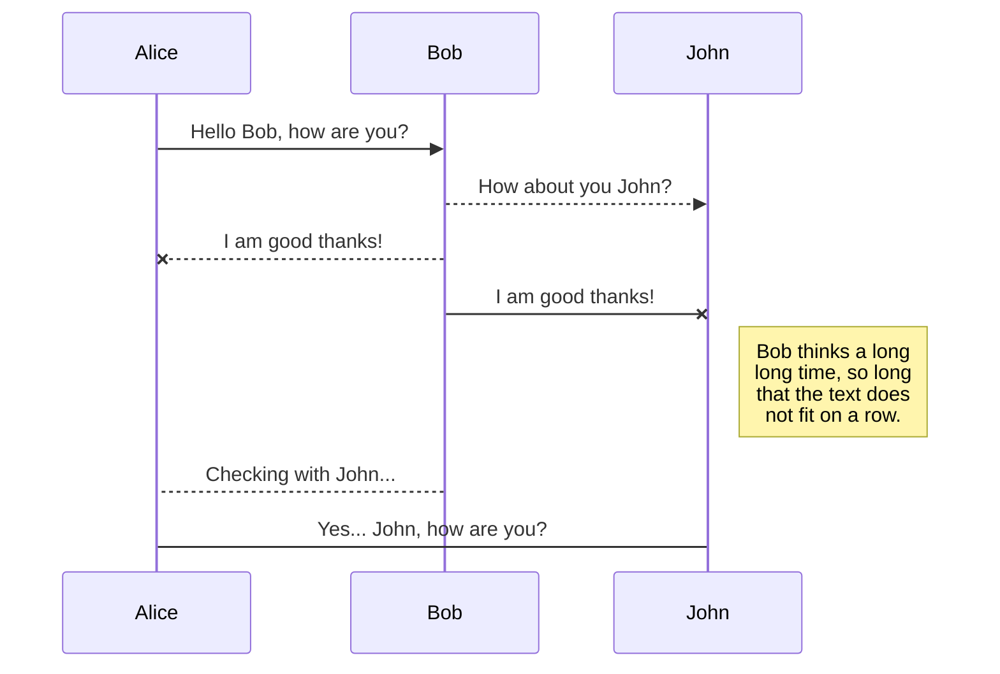
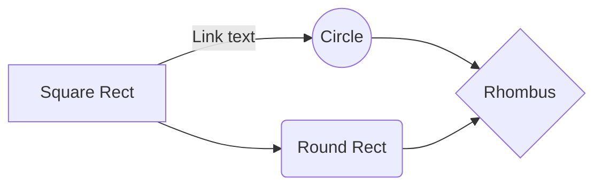

# ECUI (Engine Control Unit Interface)

This project was originally developed to construct a user interface for the development of a Rocket Engine at a testing facility. It represents a foundation for a future Project which enables full control for a rocket launch procedure, like "Mission Control". There are three main design goals which had been followed during development:

1. A possibility to provide the current state of the facility to an arbitrary number of users/viewers.
2. A very accurate timing interface, to execute commands at a precise point in time.
3. A monitoring surface for all sensor values on the test stand.

To enable all of these features, multiple Software Layers have been developed. 

## Table of Contents

1. [Architecture](#architecture)
2. [Web-Client](#web-client)
3. [Web-Server](#web-server)
4. [LLServer](#llserver)

## Architecture

The user interface is written in HTML, CSS and JavaScript. This approach helps to generate a dynamic GUI and 
and provides Tablet and Smartphone support built in. In addition a **Web-Server** is running in the background, so the user interface can be opened with multiple devices at the same time. Currently the last user who connected to the server functions as the **master**. This means that only that user is able to control the test stand, while all others are only **watchers** and cannot manipulate or interfere any ongoing process.
The communication Protocol used between Web-Client and Web-Server is called Socket.io. 

The **LLServer** functions mainly as an accurate Timer and sends commands defined by the Sequence-File
to the **Hedgehog-Controller**

## Web-Client

The Web-Client provides the interface between the end user and the ECUI System. When the Raspberry-Pi
is connected to the same network, it can be accessed in Chrome, Firefox or Safari via the URL: 

[raspberrypi.local:3000](http://raspberrypi.local:3000)

If multiple Clients are connected to the Server it automatically syncs any changes on one client to the others.
There are 3 tabs located at the top of the Webpage: the Monitor-Tab, the Control-Tab and the Calibration-Tab. 

### Monitor Tab

When the Webpage has been loaded, it first displays the **Checklist** on the right side of the display, and the 
**Sequence Chart** on the left side. When all Items in the Checklist have been ticked, an Start Sequence button 
appears. Clicking it starts the Countdown and displays live data on the bottom of the screen.

### Control Tab

In this view the "Enable Manual Control" Checkbox can be clicked to enable manual servo and motor (used for Igniter) control.
Each Servo can be moved with the sliders between 0% and 100%. The Igniter can be enabled via a Checkbox.
The Saftl button sets the Fuel servo to 100% for 2 seconds.

### Calibration Tab

Here manual control has to be enabled first. Then the raw value of a servo can be set by writing a number in the
text box. By clicking the Set Min/Set Max button, the minimum/maximum position of the servo can be set. This is used to map the percentage value in the sequence file to the actual servo position.

> **CAREFUL:** SERVOS CAN BE DESTROYED WHEN VALUE IS TOO HIGH OR TOO LOW
> &nbsp;&nbsp;&nbsp;&nbsp;&nbsp;&nbsp; Ask for help, when you're not sure about the safe range of the servo

## Web-Server

The Web-Server is written in JavaScript with Node.js. On one hand it manages synchronization tasks between
each client, on the other it also communicates with the LLServer and hands messages over to the client.

The Web-Server represents the Server for the Web-Client and at the same time the Server for the TCP Socket
communication with the LLServer. When the server is started, it waits for the LLServer to connect. 
**If the Web-Client connects and clicks on the Start Sequence button before the LLServer is connected, it won't start the Sequence.** The Sequence File is located in the Web-Servers local directory.

## LLServer (low-level Server) {#llserver}

The LLServer is mainly responsible for coordinating the timing between the Sequence and the actual
execution of each command. When the program is started, it waits for a server to connect to (Web-Server)
After that the Web-Server needs to send the LLServer it's current Sequence and Abort Sequence which shall be executed. If there's
any other event before that, it may result in a **crash** of the LLServer! 

 - **Timer** is managing high resolution Clock and fires an event after a specific tick interval
 - **SequenceManager** is responsible to start the timer and handles actions on abort. 
 - **HcpManager** represents an abstract version of the Serial communication with the Hedgehog-Controller  
 - **HcpCommands** defines all Messages there can be sent or received over the HCP Protocol
 - **Serial** is responsible for communicating with the Controller on byte level
 - **Debug** prints to the console and can be enabled or disabled 
 - **utils** provides general tools for the Application
 - **Logging** manages Sensor logging during a test run
 - **config** config variables for the program

Whenever the Sequence is started the server creates a Log file with the current Timestamp as name and logs
sensor data in a specific sample rate, which can be specified in the config file.

## Delete a file

You can delete the current file by clicking the **Remove** button in the file explorer. The file will be moved into the **Trash** folder and automatically deleted after 7 days of inactivity.

## Export a file

You can export the current file by clicking **Export to disk** in the menu. You can choose to export the file as plain Markdown, as HTML using a Handlebars template or as a PDF.

# Synchronization

Synchronization is one of the biggest features of StackEdit. It enables you to synchronize any file in your workspace with other files stored in your **Google Drive**, your **Dropbox** and your **GitHub** accounts. This allows you to keep writing on other devices, collaborate with people you share the file with, integrate easily into your workflow... The synchronization mechanism takes place every minute in the background, downloading, merging, and uploading file modifications.

There are two types of synchronization and they can complement each other:

- The workspace synchronization will sync all your files, folders and settings automatically. This will allow you to fetch your workspace on any other device.
	> To start syncing your workspace, just sign in with Google in the menu.

- The file synchronization will keep one file of the workspace synced with one or multiple files in **Google Drive**, **Dropbox** or **GitHub**.
	> Before starting to sync files, you must link an account in the **Synchronize** sub-menu.

## Open a file

You can open a file from **Google Drive**, **Dropbox** or **GitHub** by opening the **Synchronize** sub-menu and clicking **Open from**. Once opened in the workspace, any modification in the file will be automatically synced.

## Save a file

You can save any file of the workspace to **Google Drive**, **Dropbox** or **GitHub** by opening the **Synchronize** sub-menu and clicking **Save on**. Even if a file in the workspace is already synced, you can save it to another location. StackEdit can sync one file with multiple locations and accounts.

## Synchronize a file

Once your file is linked to a synchronized location, StackEdit will periodically synchronize it by downloading/uploading any modification. A merge will be performed if necessary and conflicts will be resolved.

If you just have modified your file and you want to force syncing, click the **Synchronize now** button in the navigation bar.

> **Note:** The **Synchronize now** button is disabled if you have no file to synchronize.

## Manage file synchronization

Since one file can be synced with multiple locations, you can list and manage synchronized locations by clicking **File synchronization** in the **Synchronize** sub-menu. This allows you to list and remove synchronized locations that are linked to your file.

# Publication

Publishing in StackEdit makes it simple for you to publish online your files. Once you're happy with a file, you can publish it to different hosting platforms like **Blogger**, **Dropbox**, **Gist**, **GitHub**, **Google Drive**, **WordPress** and **Zendesk**. With [Handlebars templates](http://handlebarsjs.com/), you have full control over what you export.

> Before starting to publish, you must link an account in the **Publish** sub-menu.

## Publish a File

You can publish your file by opening the **Publish** sub-menu and by clicking **Publish to**. For some locations, you can choose between the following formats:

- Markdown: publish the Markdown text on a website that can interpret it (**GitHub** for instance),
- HTML: publish the file converted to HTML via a Handlebars template (on a blog for example).

## Update a publication

After publishing, StackEdit keeps your file linked to that publication which makes it easy for you to re-publish it. Once you have modified your file and you want to update your publication, click on the **Publish now** button in the navigation bar.

> **Note:** The **Publish now** button is disabled if your file has not been published yet.

## Manage file publication

Since one file can be published to multiple locations, you can list and manage publish locations by clicking **File publication** in the **Publish** sub-menu. This allows you to list and remove publication locations that are linked to your file.

# Markdown extensions

StackEdit extends the standard Markdown syntax by adding extra **Markdown extensions**, providing you with some nice features.

> **ProTip:** You can disable any **Markdown extension** in the **File properties** dialog.

## SmartyPants

SmartyPants converts ASCII punctuation characters into "smart" typographic punctuation HTML entities. For example:

|                |ASCII                          |HTML                         |
|----------------|-------------------------------|-----------------------------|
|Single backticks|`'Isn't this fun?'`            |'Isn't this fun?'            |
|Quotes          |`"Isn't this fun?"`            |"Isn't this fun?"            |
|Dashes          |`-- is en-dash, --- is em-dash`|-- is en-dash, --- is em-dash|

## KaTeX

You can render LaTeX mathematical expressions using [KaTeX](https://khan.github.io/KaTeX/):

The *Gamma function* satisfying $\Gamma(n) = (n-1)!\quad\forall n\in\mathbb N$ is via the Euler integral

$$
\Gamma(z) = \int_0^\infty t^{z-1}e^{-t}dt\,.
$$

> You can find more information about **LaTeX** mathematical expressions [here](http://meta.math.stackexchange.com/questions/5020/mathjax-basic-tutorial-and-quick-reference).

## UML diagrams

You can render UML diagrams using [Mermaid](https://mermaidjs.github.io/). For example, this will produce a sequence diagram:

And this will produce a flow chart:

